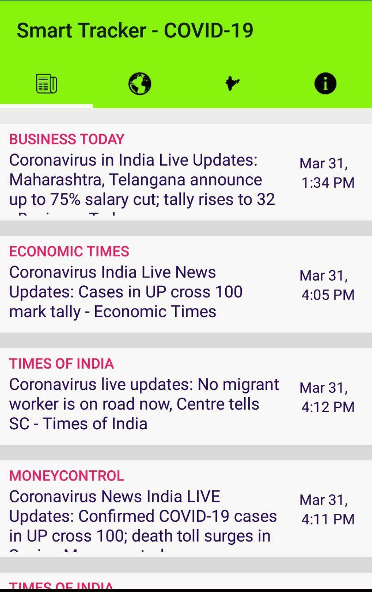
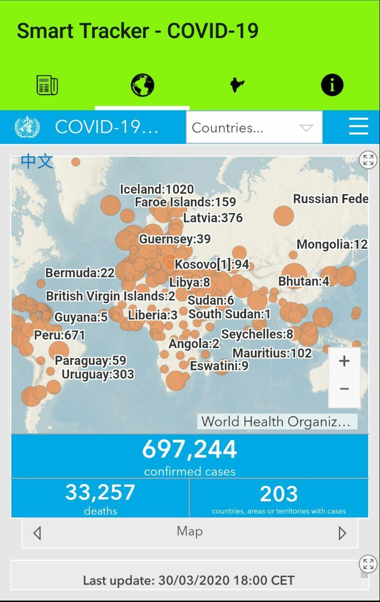
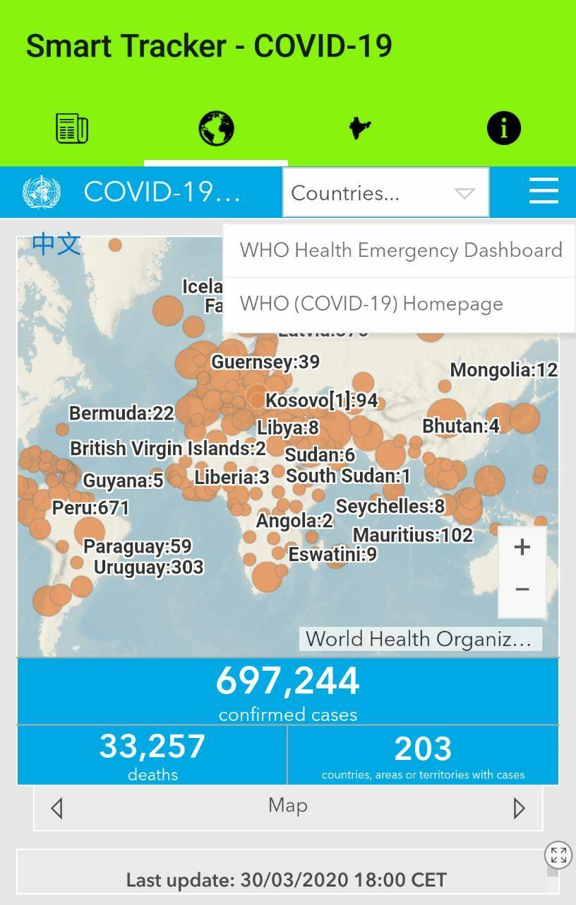
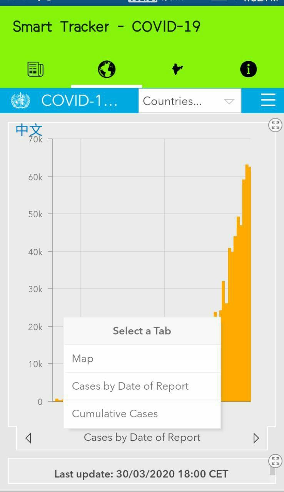
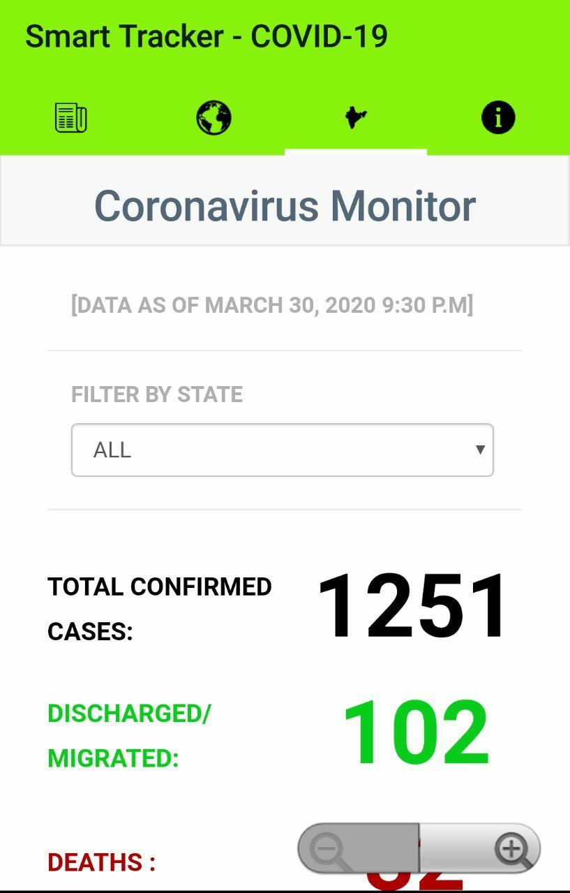
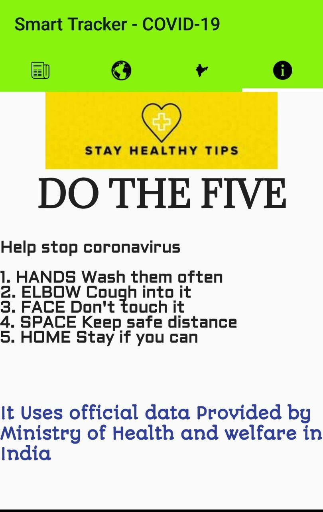

# Smart-Tracker-COVID-19

## Details

###### Software Edition
###### Team Name    :  BugZero
###### Theme Name  :   COVID-19 and Quarantine
###### College Name :  Walchand Institute of Technology, Solapur
###### Team Details:
1. Pramod Paratabadi – 9158038227
2. Supriya Madiwal - 9766844410

## Idea Description
Android app to track the spread of Corona Virus (COVID-19) : (Smart Tracker – COVID-19)
Now a days whole world facing the novel Corona Virus, to track the spread of novel Corona Virus country-wise, details of confirmed cases, deaths and Recovered, awareness regarding COVID-19. This Android app was created to spread awareness about the covid -19 virus. It contains the following functionalities:
1.	Displays relevant news about covid-19.
2.	Real-time Dashboard that tracks the recent cases of covid-19 across the world and across different states in India.
3.	The app is specifically shows the relevance data regarding India, it also include testing centers across different states in 	India.
4.	The last section includes some tips that should follow in this epidemic.

	
## Prerequisites
 You will need the following things properly run it on your computer.

- [Android Studio](https://developer.android.com/studio)

## Download App here
[SmartTrack_COVID-19](https://drive.google.com/file/d/1IRrXt93yfd-_R8jwnkZYsHdi4wNFv9LI/view?usp=sharing)
## Setup
###### How will you implement the idea? :
###### For this idea we have used following tech stack :
- IDE : [Android Studio](https://developer.android.com/studio)
- [Github repo link](https://github.com/pramod-Paratabadi/COVID-19)

### Clone the repository and build on Android Studio

###### Dependencies :
- User should have proper internet facility.
###### For the live news update worldwide we have used :
- COVID-19 Dashboard that shows the real-time data of death cases
###### For the live data of Indian COVID-19 cases we have used :
- Coronavirus Monitor
- Ministry of Health and Welfare of India

## Who are the potential customers and how it will benefit them? :
The app is useful for those who want data regarding COVID-19. The people from every domain should use this application as it helps to plan to avoid more cases in this epidemic. Government should make a proper planning of beds in hospital, isolation rooms, available more testing kit to the doctors and also plan for necessary steps to be taken out to prevent the coronavirus spread.

## Working of Application 
###### Vedio Link: [SmartTrack](https://drive.google.com/file/d/1vEzBMFWMBct7SetWx6kwu3zqCkILLdRR/view?usp=sharing)
## ScreenShots

######  
######  
######  
######  
######  
###### 
###### 
######  
######  
